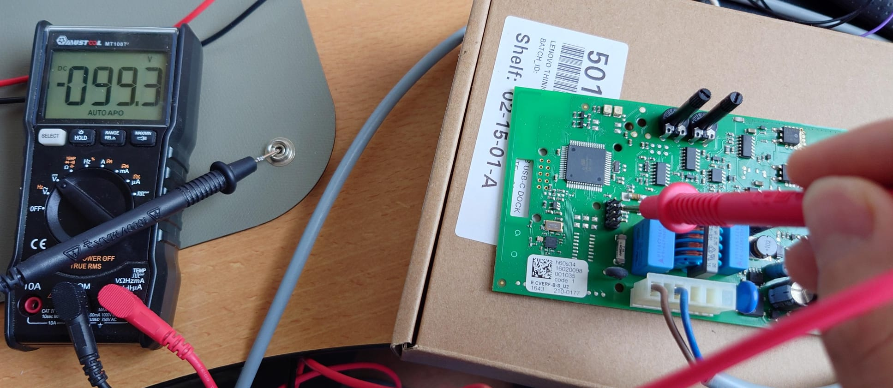
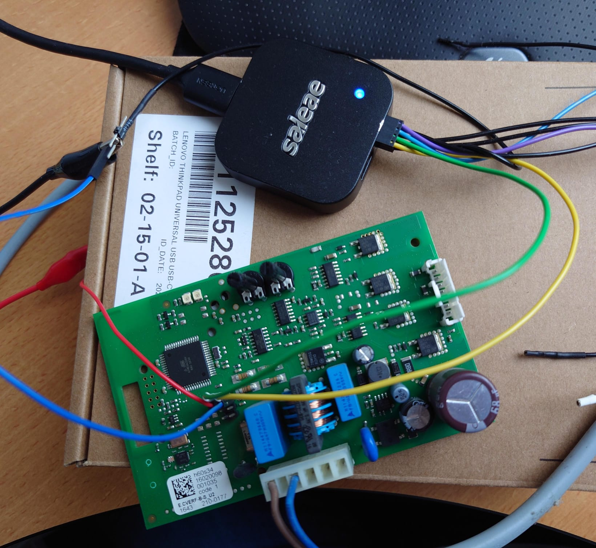

# ZigbeeCVE

This project is about the CVE central ventilation unit by Itho Daalderop, used widely in the Netherlands. It can be controlled by a mechanical switch and current units can be controlled by a remote control to set the intensity.

The remote is working on 868 MHz and is working fine, however my child threw one in the bathroom sink and the radio chip did not survive. Buying a new remote is rather expensive and that made me search for alternatives.

## Solder a new CC1150 chip
Yes, this would be the most easy and less expensive way, but I had some domotica plans for this fan for automating.

## Emulate a remote control
There are a handful projects about emulating a remote control, but this is convenient for me, as I would like to change settings in e.g. my bathroom to go full throttle while showering. I might connect this to Home Assistant with some wrappers and software but...no.

## Go for Arjen Hiemstra's solution

Arjen actually inspired me for working on this project. He found out that you can control the CVE fan by writing I2C messages on a I2C bus exposed on a pin header inside the CVE fan. He also made a PCB and software that can do all kind of things. I really like his solution, but it will require additional software on HA to make it work in a automated system. You can find his repo at:

https://github.com/arjenhiemstra/ithowifi

## Go the Arjen way, but rather use the standard Zigbee Light Link, used for Hue, TRÅDFRI, and register as dimmable light that actually controls the CVE. Yes!

By using a Nordic NRF52840, capable of running Nordic's Zigbee stack, We can easily enable Zigbee and have the NRF send out I2C messages to the CVE fan.

There is a 8 pin header present on the CVE control unit board, that exposes the required lines.

### Warning: The low level part of the PCB is actually floating about 100V above PE! 
I got warned reading Arjens thread about the development and you easily create a ground loop that put 100V on 5V capable pins. I solved this by instead of using the powerplug, just injecting 5V on the output of the 75M05 LDO, with a PSU that has respect to my PC's USB ground. The system will draw about 40mA without the fan connected.

You don't want to connect this to your logic analyzer

But with a ground respected power supply, you are good to go. Note! The AC mains is NOT connected right now, power is injected by the blue and red wire!

